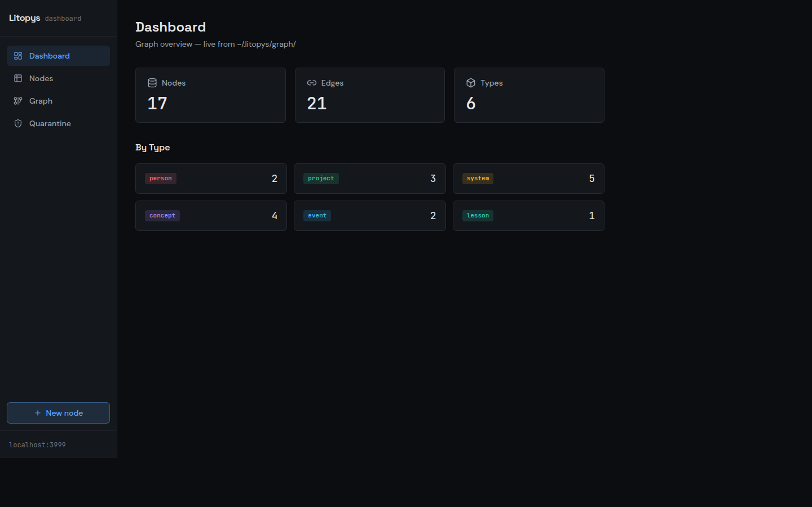
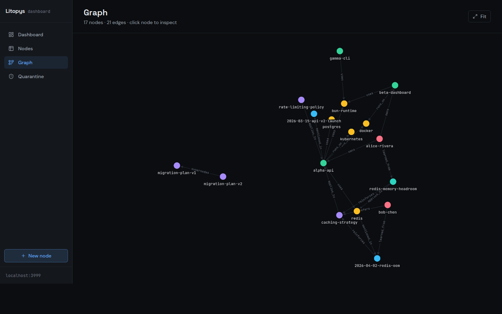
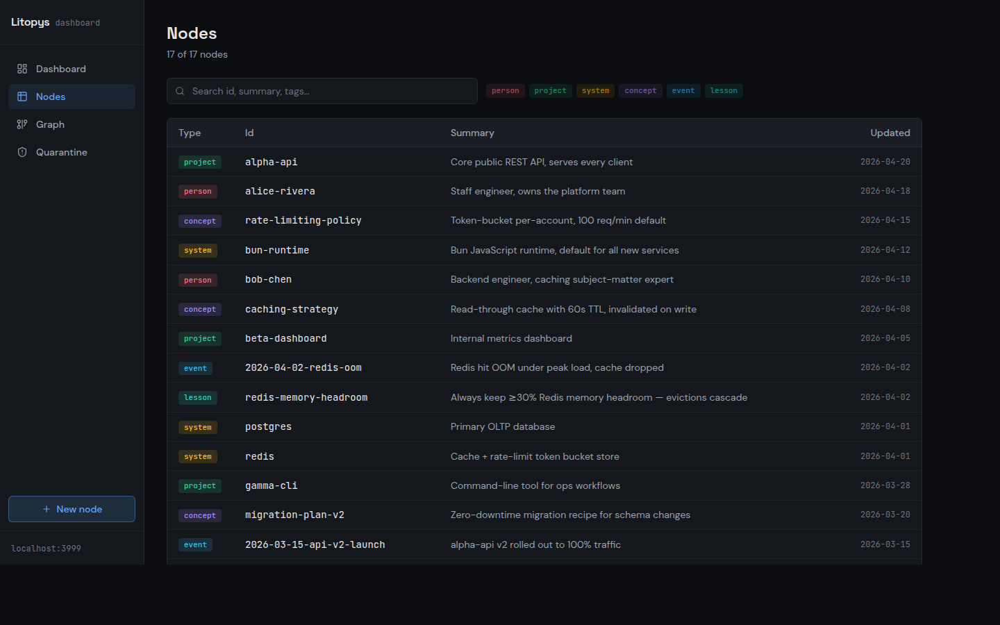
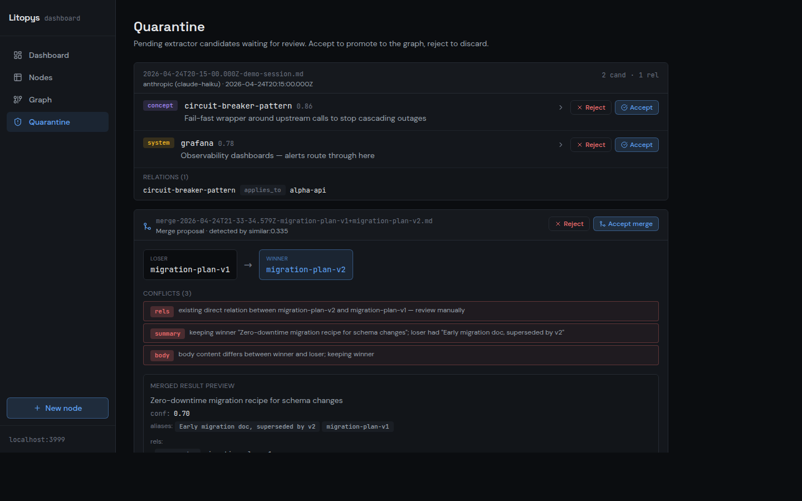

<div align="center">

# 📜 Litopys

**A living chronicle for your AI.**

Persistent graph-based memory that survives across sessions and clients.
Built for Claude Code, Claude Desktop, and any MCP-compatible agent.

**[litopys-dev.github.io/litopys](https://litopys-dev.github.io/litopys/)** — install, screenshots, and quick-start

[](https://github.com/litopys-dev/litopys/actions/workflows/ci.yml)
[](LICENSE)
[](https://bun.sh)

</div>

---

## Why Litopys?

Memory systems for AI agents today force a tradeoff: either heavy vector databases with subprocess leaks and ~500 MB RAM footprint, or flat markdown files that don't scale past a few dozen notes.

**Litopys takes a third path:** a typed graph of knowledge stored in plain markdown, served through a thin MCP layer (~75 MB RAM), editable by hand, queryable by both keyword and structure. Litopys means "chronicle" in Ukrainian — because that's exactly what your AI's memory should be: a living record of what it learned about you, when, and why.

## Features

- 🧠 **Typed graph** — 6 node types (person, project, system, concept, event, lesson) with 11 first-class relations
- 🔌 **MCP-native** — works with Claude Code, Claude Desktop, Cursor, Cline, or any MCP client (see [docs/integrations](docs/integrations))
- 📝 **Markdown-first** — every node is a plain `.md` file with YAML frontmatter. Hand-editable, grep-able, git-versioned
- 🤖 **Model-agnostic extractor** — Anthropic, OpenAI, or local Ollama. Pick by your resource/cost budget (see [Resource footprint](#resource-footprint) below). Facts flow through a quarantine so nothing lands unreviewed
- 🌐 **Web dashboard** — browse, search, edit, visualize the graph, and review quarantine at `http://localhost:3999`
- 🔐 **Stays local** — graph lives in `~/.litopys/graph/` as files; the server binds to `127.0.0.1` by default; no telemetry

## Dashboard

<p align="center">
  
  
</p>
<p align="center">
  
  
</p>

Screenshots taken against a synthetic demo graph bundled in `docs/screenshots/` — not the author's personal notes.

## Status

**[v0.1.1](https://github.com/litopys-dev/litopys/releases/tag/v0.1.1) is out** — prebuilt binaries for Linux / macOS / Windows (x64 + arm64) in the release. First stable tag after two weeks of daily-driver use by the author. Public surfaces (MCP tools, CLI, JSON export `schemaVersion: 1`, on-disk markdown layout) are frozen; breaking changes will ship as `0.2.x`.

Core graph, MCP server (5 tools, stdio + HTTP/SSE), extractor + quarantine + weekly digest, timer-daemon, dashboard (read + write + graph viz + quarantine review), identity-resolution guardrails, single-binary build, one-line installer, per-client integration docs — all shipped. See [What's next](#whats-next) for the planned follow-ups.

## Resource footprint

Honest numbers from the author's own install (Ubuntu, Bun 1.x). The MCP server is cheap; the extractor is where the bill shows up, and it depends on which adapter you pick.

| Component                    | RAM        | When it costs                         |
|------------------------------|------------|---------------------------------------|
| MCP server (stdio or HTTP)   | ~75 MB     | always, while a client is connected   |
| Viewer / web dashboard       | ~50 MB     | optional, only while running          |
| Extractor — Anthropic / OpenAI | 0 locally | per API call (tokens), no local RAM   |
| Extractor — Ollama + 3B model  | ~2–3 GB   | only during a tick, unloaded after    |
| Extractor — Ollama + 7B model  | ~5 GB     | only during a tick, unloaded after    |

So the minimum resident cost is ~75 MB for the MCP server. Extraction is optional — you can run Litopys read/write-only from your agent and never start the daemon. If you do enable extraction, the local-Ollama route trades cash for RAM; the Anthropic/OpenAI route trades RAM for cents per session. Ollama's `keep_alive` means the 3B/7B figures are transient — the model drops out of RAM a few minutes after the tick finishes.

## Quick Start

One-line install (Linux / macOS):

```bash
curl -fsSL https://raw.githubusercontent.com/litopys-dev/litopys/main/install.sh | sh
```

This downloads a single ~100 MB binary to `~/.local/bin/litopys`, initializes `~/.litopys/graph/` with the required subdirectories, and prints MCP registration hints.

Pin a specific version by placing the assignment **after the pipe** — env vars set before `curl` only scope to `curl` itself, not the piped shell:

```bash
curl -fsSL https://raw.githubusercontent.com/litopys-dev/litopys/main/install.sh | LITOPYS_VERSION=v0.1.1 sh
```

Then register the MCP server with your client:

```bash
# Claude Code
claude mcp add litopys -- ~/.local/bin/litopys mcp stdio
```

```json
// Claude Desktop — ~/Library/Application Support/Claude/claude_desktop_config.json
{
  "mcpServers": {
    "litopys": {
      "command": "/home/you/.local/bin/litopys",
      "args": ["mcp", "stdio"]
    }
  }
}
```

Restart the client. The `litopys://startup-context` resource auto-loads the owner profile, active projects, recent events, and key lessons on every new session. The agent reads/writes through five MCP tools: `litopys_search`, `litopys_get`, `litopys_related`, `litopys_create`, `litopys_link`.

Full client-specific recipes live in [`docs/integrations/`](./docs/integrations/) — Claude Code, Claude Desktop, Cursor, Cline, ChatGPT Connectors, Gemini.

### Remote (HTTP/SSE) mode

For remote clients (Claude Desktop connectors, browser-based MCP hosts):

```bash
LITOPYS_MCP_TOKEN=your-secret litopys mcp http
# listens on 127.0.0.1:7777 by default
# set LITOPYS_MCP_BIND_ADDR=0.0.0.0 + TLS proxy for remote exposure
# set LITOPYS_MCP_CORS_ORIGIN=https://your-client to enable CORS
```

### Dev install (from source)

```bash
git clone https://github.com/litopys-dev/litopys.git
cd litopys
bun install
bun run build:binary       # produces dist/litopys
```

### Optional — daemon for long-running transcripts

```bash
cp packages/daemon/systemd/litopys-daemon.{service,timer} ~/.config/systemd/user/
systemctl --user enable --now litopys-daemon.timer
```

### Optional — web dashboard autostart

The dashboard (`litopys viewer`) can run as a systemd user service so it comes
back after every reboot. Listens on `127.0.0.1:3999` by default — no public
exposure, reach it over LAN / WireGuard.

```bash
litopys viewer install          # writes unit, daemon-reload, enable --now
systemctl --user status litopys-viewer

# Remove:
litopys viewer uninstall
```

Or set `LITOPYS_ENABLE_VIEWER=1` when running `install.sh` to enable it as
part of the one-line install. Requires `loginctl enable-linger $USER` if you
want the dashboard to stay up across logouts.

### Integrity check

```bash
litopys check           # human-readable report, grouped by error kind
litopys check --json    # { nodeCount, edgeCount, errorCount, errors[] } for CI
```

Loads and resolves the entire graph, then flags broken refs, duplicate ids,
wrong-typed relations, and parse/validation failures. Exits non-zero when
issues are found — drop it into a git pre-push hook or CI step so drift never
lands silently.

### Backing up your graph

Litopys stores everything as plain markdown in `~/.litopys/graph/`, so any tool
that versions files works. Two common approaches:

**Git + private remote** (incremental history, offsite, free):

```bash
cd ~/.litopys
git init
git add graph/ .gitignore README.md
git commit -m "baseline"
gh repo create my-litopys-graph --private --source=. --push
```

From then on, every session-end hook or manual accept leaves your working tree
dirty — periodically `git add -A && git commit -m "sync" && git push` to keep
the backup current. Your graph contains personal facts, so keep the remote
**private**.

**JSON snapshot** (portable, diffable, tool-friendly):

```bash
litopys export > graph.json              # compact
litopys export --pretty > graph.json     # indented, VCS-friendly
litopys export --no-body > meta.json     # metadata only, strip markdown bodies
```

The dump carries `meta` (exportedAt, counts, schemaVersion) plus all nodes
sorted by id and edges sorted by `(from, relation, to)` — deterministic across
runs, so `diff graph-yesterday.json graph-today.json` tells you exactly what
the LLM/daemon added. Feed it to analysis tools, migrate between hosts, or
commit alongside code.

Restore from a snapshot on a fresh host (or after a reinstall):

```bash
litopys import graph.json --dry-run   # preview the plan
litopys import graph.json             # create new nodes, skip existing ones
litopys import graph.json --force     # also overwrite existing ids
```

Default is conservative — existing nodes are never touched unless you pass
`--force`. Every node is validated against the schema up-front, so a corrupt
snapshot aborts before anything lands on disk.

## What's next

- Astro landing page
- `npm` publish of `@litopys/cli` as a thin launcher around the single-binary

Full release history lives in [CHANGELOG.md](./CHANGELOG.md).

## Design principles

- **Agent-agnostic.** No hard dependency on any LLM vendor or client. MCP is the only integration point. Ollama is the default extractor; Anthropic/OpenAI are optional adapters.
- **Portable data.** The graph is plain markdown + YAML frontmatter on disk. Readable in any editor, versionable in git, greppable from the shell.
- **Light runtime.** ~75 MB RAM for the MCP server. The extractor is out-of-process and runs on your schedule, not on every request — see [Resource footprint](#resource-footprint) for the full cost breakdown across adapters.
- **Opt-in integrations.** Client-specific helpers (hooks, config snippets) live in `docs/integrations/` — you can use Litopys without any of them.

## License

MIT © 2026 Denis Blashchytsia and Litopys contributors.
