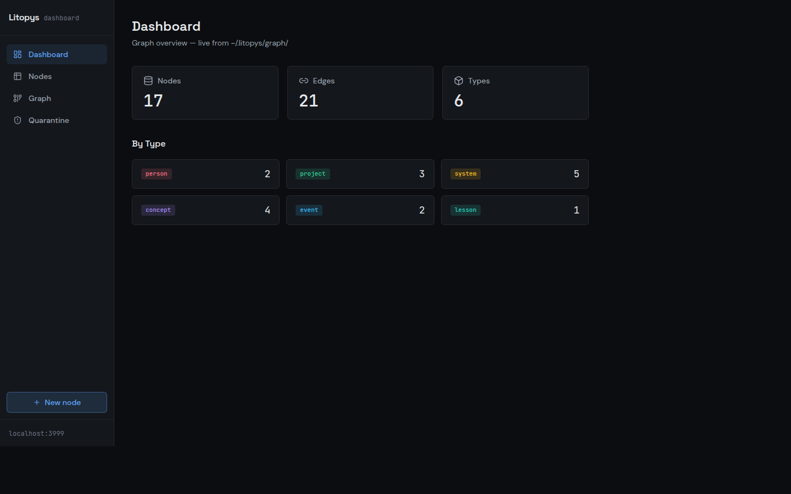
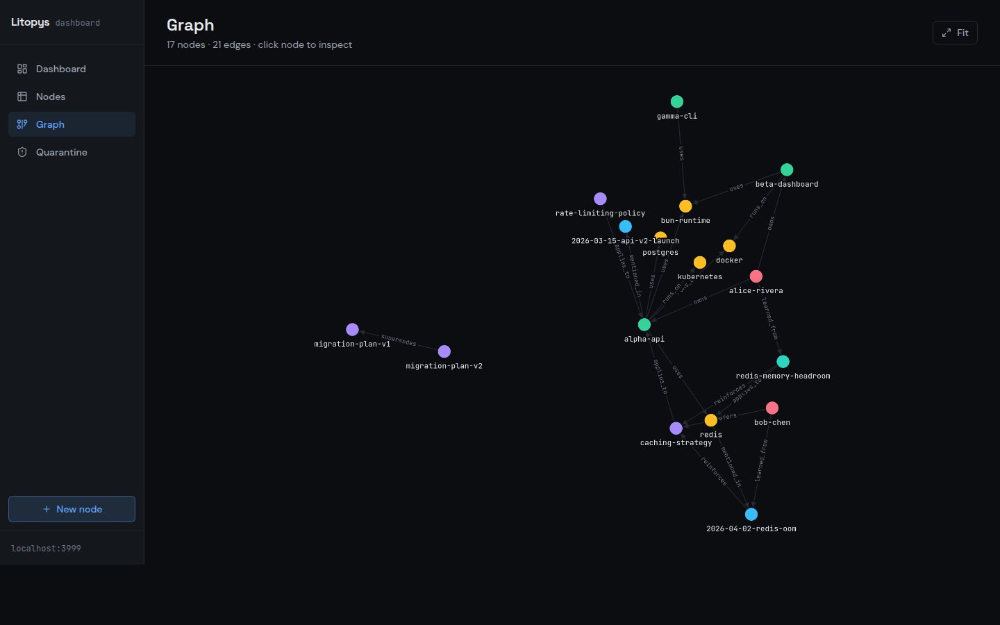
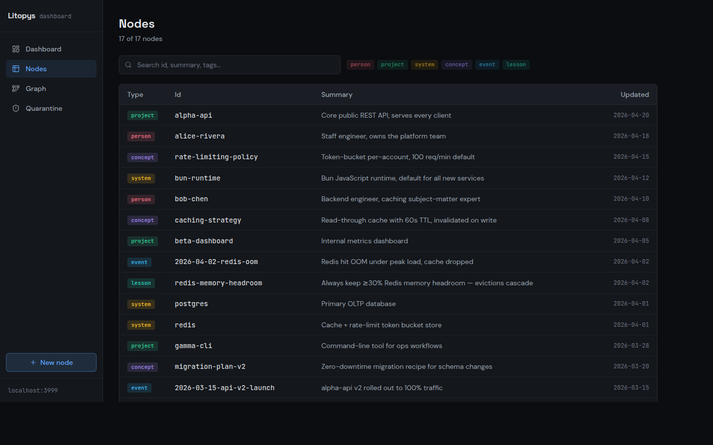
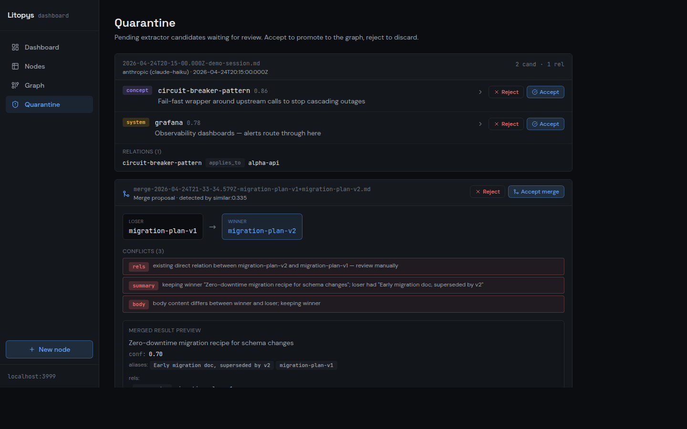

<div align="center">

# 📜 Litopys

**Жива хроніка для вашого ШІ.**

Постійна пам'ять на основі графу, що зберігається між сесіями та клієнтами, —
і детектор скілів, який перетворює ваші повторювані рутини на багаторазові скіли.
Розроблено для Claude Code, Claude Desktop і будь-якого MCP-сумісного агента.

**[litopys-dev.github.io/litopys](https://litopys-dev.github.io/litopys/)** — встановлення, знімки екрана та швидкий старт

[](https://github.com/litopys-dev/litopys/actions/workflows/ci.yml)
[](LICENSE)
[](https://bun.sh)

</div>

> 🇬🇧 [Read in English](./README.md)

---

## Навіщо Litopys?

Сучасні системи пам'яті для ШІ-агентів змушують вибирати: або важкі векторні бази даних із витоками підпроцесів і ~500 МБ оперативної пам'яті, або плоскі markdown-файли, що не масштабуються далі кількох десятків нотаток.

**Litopys обирає третій шлях:** типізований граф знань у звичайних markdown-файлах, доступний через легкий MCP-шар (~75 МБ RAM), придатний для редагування вручну та запитів як за ключовими словами, так і за структурою. Litopys — це «хроніка» українською, і саме такою має бути пам'ять вашого ШІ: жива хроніка того, що він дізнався про вас, коли і чому.

Та пам'ять — це більше, ніж факти. Агент, який пам'ятає, що *«staging-сервер на 10.0.0.5»*, але щосесії заново вигадує, *як на нього деплоїти*, навчений лише наполовину. Тому Litopys тримає два шари пам'яті:

| Шар | Що зберігає | Де живе |
|---|---|---|
| **Граф знань** | Факти: люди, проєкти, системи, рішення, уроки | `~/.litopys/graph/` — markdown-вузли + типізовані ребра |
| **Детектор скілів** | Процедури: рутини, які ви повторювали в різних сесіях, оформлені як чернетки `SKILL.md` | `~/.litopys/episodes/` → quarantine → каталог скілів вашого агента |

Обидва шари працюють за принципом «спершу перевірка»: нічого з того, що видобув LLM, нікуди не потрапляє без проходження через quarantine, який контролюєте ви.

## Можливості

- 🧠 **Типізований граф** — 6 типів вузлів (person, project, system, concept, event, lesson) з 11 відношеннями першого класу
- 🔁 **Детектор скілів** — спостерігає за вашими сесіями, помічає повторювані рутини та готує чернетки `SKILL.md`; ви переглядаєте та встановлюєте однією командою (див. [Процедурна пам'ять](#процедурна-память--детектор-скілів))
- 🕰 **Бітемпоральні запити** — кожен вузол несе час події (`occurred_at`, `since`, `until`) незалежно від часу останнього запису файлу; запитуйте «що було істиною на дату X?» через параметр `as_of` (див. [docs/temporal-model.md](docs/temporal-model.md))
- 🔌 **MCP-native** — працює з Claude Code, Claude Desktop, Cursor, Cline або будь-яким MCP-клієнтом (див. [docs/integrations](docs/integrations/README.uk.md))
- 📝 **Markdown передусім** — кожен вузол є звичайним `.md`-файлом із YAML frontmatter. Редагується вручну, доступний через grep, версіонується в git
- 🧹 **Обслуговування графу** — `litopys evolve` архівує надгробкові (tombstoned) вузли (з аудитованим маніфестом) і автоматично застосовує merge-пропозиції з високою впевненістю з quarantine (див. [docs/memory-evolution.md](docs/memory-evolution.md))
- 🤖 **Агностичний екстрактор** — Anthropic, OpenAI, локальний Ollama або будь-який OpenAI-сумісний ендпоінт. Вибирайте відповідно до ресурсів і бюджету (див. [Споживання ресурсів](#споживання-ресурсів)). Факти проходять через quarantine, тому нічого не потрапляє до графу без перевірки
- 🌐 **Вебпанель** — перегляд, пошук, редагування, візуалізація графу, перевірка quarantine та чернеток скілів за адресою `http://localhost:3999`
- 🔐 **Залишається локальним** — граф зберігається в `~/.litopys/graph/` як файли; сервер за замовчуванням прив'язаний до `127.0.0.1`; без телеметрії

## Панель керування

<p align="center">
  
  
</p>
<p align="center">
  
  
</p>

Знімки екрана зроблені на синтетичному демо-графі, що входить до складу `docs/screenshots/` — не особисті нотатки автора.

## Статус

**[v0.2.0](https://github.com/litopys-dev/litopys/releases/tag/v0.2.0) вийшла** — бітемпоральна модель (`occurred_at` / `since` / `until` на кожному вузлі, запити `as_of`), команда обслуговування `litopys evolve` та гарнес бенчмарків `@litopys/bench` — див. [CHANGELOG](./CHANGELOG.md). Готові двійкові файли для Linux / macOS / Windows (x64 + arm64) із SHA-256 контрольними сумами, що перевіряються `install.sh`.

**Нове в `main` (ще не випущено, вийде як v0.3.0):** **детектор скілів** — шар процедурної пам'яті, який видобуває робочі епізоди з ваших сесій і готує чернетки `SKILL.md` для перегляду (CLI `litopys skills`, вкладка вебпанелі, розділ у дайджесті). Тестовий набір — **874 / 874** успішних. Публічні інтерфейси (MCP tools, CLI, JSON-експорт `schemaVersion: 1`, розташування markdown на диску) залишаються зворотньо сумісними.

Ядро графу, MCP-сервер (5 інструментів, stdio + HTTP/SSE), екстрактор + quarantine + щотижневий дайджест, daemon з таймером, вебпанель (читання + запис + візуалізація графу + перевірка quarantine + чернетки скілів), захист від дублювання ідентичностей, збірка в один двійковий файл, однорядковий інсталятор, документація інтеграції для кожного клієнта — все доставлено. Заплановані наступні кроки описані в розділі [Що далі](#що-далі).

## Швидкий старт

Однорядкова установка (Linux / macOS):

```bash
curl -fsSL https://raw.githubusercontent.com/litopys-dev/litopys/main/install.sh | sh
```

Завантажує єдиний двійковий файл (~100 МБ) до `~/.local/bin/litopys`, ініціалізує `~/.litopys/graph/` з необхідними підкаталогами та виводить підказки для реєстрації MCP.

Щоб закріпити конкретну версію, передайте змінну **після pipe** — змінні середовища, встановлені перед `curl`, діють лише для `curl`, а не для piped-оболонки:

```bash
curl -fsSL https://raw.githubusercontent.com/litopys-dev/litopys/main/install.sh | LITOPYS_VERSION=v0.2.0 sh
```

Потім зареєструйте MCP-сервер у вашому клієнті:

```bash
# Claude Code
claude mcp add litopys -- ~/.local/bin/litopys mcp stdio
```

```json
// Claude Desktop — ~/Library/Application Support/Claude/claude_desktop_config.json
{
  "mcpServers": {
    "litopys": {
      "command": "/home/you/.local/bin/litopys",
      "args": ["mcp", "stdio"]
    }
  }
}
```

Перезапустіть клієнт. Ресурс `litopys://startup-context` автоматично завантажує профіль власника, активні проєкти, останні події та ключові уроки на початку кожної нової сесії. Агент читає і записує через п'ять MCP-інструментів: `litopys_search`, `litopys_get`, `litopys_related`, `litopys_create`, `litopys_link`.

Повні рецепти для кожного клієнта — у [`docs/integrations/`](./docs/integrations/README.uk.md): Claude Code, Claude Desktop, Cursor, Cline, ChatGPT Connectors, Gemini.

### Режим Remote (HTTP/SSE)

Для віддалених клієнтів (конектори Claude Desktop, браузерні MCP-хости):

```bash
LITOPYS_MCP_TOKEN=your-secret litopys mcp http
# слухає на 127.0.0.1:7777 за замовчуванням
# встановіть LITOPYS_MCP_BIND_ADDR=0.0.0.0 + TLS-проксі для публічного доступу
# встановіть LITOPYS_MCP_CORS_ORIGIN=https://your-client для увімкнення CORS
```

### Встановлення з вихідного коду

```bash
git clone https://github.com/litopys-dev/litopys.git
cd litopys
bun install
bun run build:binary       # створює dist/litopys
```

## Процедурна пам'ять — детектор скілів

Граф знань пам'ятає *факти*. Детектор скілів пам'ятає, *як ви працюєте*.

**Яку проблему він розв'язує.** Поспостерігайте за сесіями власного агента тиждень — і помітите, що ті самі багатокрокові рутини повертаються знову й знову: «перезапусти той сервіс і перевір логи», «перегенеруй клієнт після зміни схеми», «той самий танець для деплою на staging». Claude Code вміє завантажувати такі процедури з файлів `SKILL.md` — але хтось має *помітити* рутину й написати скіл. Цей «хтось» зазвичай — ніхто.

**Що він робить.** Детектор скілів переглядає ваші транскрипти, помічає роботу, яку ви виконували більш ніж один раз, і пише чернетку скіла за вас. Ви переглядаєте її та встановлюєте однією командою. З часом ваш агент помітно кращає саме у *ваших* рутинах — включно з тими вистражданими, де правильний підхід знайшовся лише після кількох невдалих спроб.

### Як це працює

```
сесії ──► Стадія A: епізоди ──► Стадія B: кластеризація ──► перегляд ──► встановлений скіл
         (хук / daemon,         (щоденний таймер, LLM        (CLI /       (~/.claude/skills/)
          на транскрипт)         групує + готує чернетки)     вебпанель)
```

- **Стадія A — видобування епізодів.** Під час тіків daemon (або спрацювання опційного SessionEnd-хука) кожен «охолоджений» транскрипт Claude Code розбирається на *епізоди*: компактні записи «мета + узагальнені кроки + використані інструменти + чи довелося обходити помилки». Вони дописуються в `~/.litopys/episodes/YYYY-MM.jsonl`. Тривіальні сесії (майже без інструментів, без відновлення після помилок) пропускаються без витрати LLM-виклику.
- **Стадія B — кластеризація та чернетки.** Раз на день `litopys skills tick` просить LLM згрупувати епізоди, що описують ту саму повторювану процедуру. Група, що охоплює **2+ різні сесії** — або одиничний епізод, де рішення знайшлося через відновлення після помилок, — стає чернеткою: повним `SKILL.md` з описом тригера, нумерованою процедурою, підводними каменями (взятими з того, що *не* спрацювало) та кроками перевірки.
- **Перегляд.** Чернетки потрапляють у `~/.litopys/quarantine/skills/<name>/` і чекають. **Ніщо не встановлюється саме.**

### Перегляд і встановлення чернеток

```bash
litopys skills list                       # чернетки в очікуванні
litopys skills show restart-staging       # повний перегляд SKILL.md
litopys skills promote restart-staging    # встановити в ~/.claude/skills/
litopys skills promote restart-staging --force   # перезаписати наявний скіл
litopys skills reject restart-staging "занадто специфічно для одного інциденту"
```

Зручніше через UI? На вебпанелі є вкладка **Skill drafts** з тим самим циклом перегляд / встановити / відхилити. Щотижневий дайджест теж перелічує чернетки в очікуванні, а `LITOPYS_SKILLS_NOTIFY_CMD` може сповістити вас (наприклад, Telegram-скриптом) щойно з'явиться нова чернетка.

### Налаштування

Стадії A потрібен збір транскриптів, який ви, ймовірно, вже запускаєте — [таймер daemon](#опційно--daemon-для-тривалих-транскриптів) підхоплює епізоди автоматично; SessionEnd-хук покриває їх одразу після завершення сесії. Стадія B — це ще один таймер:

```bash
cp packages/extractor/systemd/litopys-skills.{service,timer} ~/.config/systemd/user/
systemctl --user enable --now litopys-skills.timer
# або один прохід вручну:
litopys skills tick
```

### Конфігурація

Усе опційне — значення за замовчуванням розумні:

| Змінна середовища | За замовчуванням | Значення |
|---|---|---|
| `LITOPYS_SKILLS_DIR` | `~/.claude/skills` | Куди `promote` встановлює скіли |
| `LITOPYS_SKILLS_NOTIFY_CMD` | — | Shell-команда, що викликається з повідомленням при появі нової чернетки |
| `LITOPYS_SKILLS_MIN_TOOL_OPS` | `5` | Мінімум операцій з інструментами, щоб сесія вважалась нетривіальною |
| `LITOPYS_SKILLS_MIN_SESSIONS` | `2` | Скільки сесій має охоплювати кластер, перш ніж стане чернеткою |
| `LITOPYS_EPISODES_MAX_LLM_FILES` | `10` | Бюджет транскриптів на LLM за один тік догону |
| `LITOPYS_SKILLS_LANG` | `English` | Мова згенерованої прози чернетки (frontmatter залишається англійською) |

### Розраховано на нестабільні квоти

Видобування епізодів спроєктовано так, щоб переживати rate-limit безкоштовних тарифів: помилки API обривають прохід через circuit breaker (один невдалий виклик, а не шторм ретраїв), необроблені транскрипти лишаються в черзі до наступного тіку, а бюджет на тік не дає великому беклогу спалити денну квоту за один прохід. Збій LLM затримує епізоди — але ніколи їх не втрачає.

### Поточні обмеження

- Епізоди видобуваються з транскриптів **Claude Code** (адаптер джерела `claude-code`); інші формати транскриптів — у планах.

## Рецепти налаштування

### Опційно — daemon для тривалих транскриптів

Інкрементально збирає файли транскриптів за 5-хвилинним таймером; після злиття детектора скілів також виконує прохід догону епізодів.

```bash
cp packages/daemon/systemd/litopys-daemon.{service,timer} ~/.config/systemd/user/
systemctl --user enable --now litopys-daemon.timer
```

### Опційно — автозапуск вебпанелі

Вебпанель (`litopys viewer`) можна запустити як systemd user service, щоб вона відновлювалася після кожного перезавантаження.

```bash
litopys viewer install        # генерує токен, записує юніт, вмикає сервіс
litopys viewer install --lan  # те саме + прив'язка до 0.0.0.0 для доступу з LAN
systemctl --user status litopys-viewer

# Видалити:
litopys viewer uninstall
```

**Токен доступу.** `viewer install` автоматично генерує випадковий токен і зберігає його у `~/.litopys/viewer.token`. Після встановлення виводиться готове посилання з вбудованим токеном:

```
✓ litopys-viewer installed

  Open dashboard:    http://localhost:3999/?token=<token>
  Share with others: http://192.168.1.x:3999/?token=<token>   # тільки з --lan
```

Відкривши посилання один раз, токен зберігається в `localStorage` — більше запитів не буде. Щоб надати доступ іншій людині — надішліть їй посилання з `?token=…`. Переглянути токен у будь-який момент: `cat ~/.litopys/viewer.token`.

GET-ендпоінти (перегляд, пошук, граф) завжди відкриті. Мутуючі ендпоінти (створення / редагування / видалення вузлів, дії з quarantine та чернетками скілів) потребують токена.

Або встановіть `LITOPYS_ENABLE_VIEWER=1` при запуску `install.sh`, щоб увімкнути її в межах однорядкового встановлення. Потрібен `loginctl enable-linger $USER`, якщо хочете, щоб панель залишалась активною після виходу з системи.

### Опційно — Notion sync

`@litopys/notion-sync` зчитує нещодавно відредаговані сторінки Notion через REST API Notion, передає їх через налаштований LLM-екстрактор для виявлення кандидатів знань і записує результати в quarantine для перевірки. Файл стану `~/.litopys/notion-sync.json` відстежує мітку часу останньої синхронізації, тому інкрементальні запуски завантажують лише сторінки, змінені після попередньої синхронізації.

```bash
# Встановіть токен інтеграції Notion
echo 'NOTION_TOKEN=secret_...' >> ~/.litopys/.env

# Запустіть один раз для перевірки
NOTION_TOKEN=secret_... litopys notion-sync

# Або встановіть як systemd timer (запускається кожні 6 годин)
cp packages/notion-sync/systemd/litopys-notion-sync.{service,timer} ~/.config/systemd/user/
systemctl --user enable --now litopys-notion-sync.timer
```

Створіть токен інтеграції на [notion.so/my-integrations](https://www.notion.so/my-integrations) і надайте інтеграції доступ до потрібних сторінок або баз даних.

### Екстрактор — самостійно розгорнуті OpenAI-сумісні ендпоінти

Екстрактор підтримує будь-який OpenAI-сумісний сервер — vLLM, LM Studio, LocalAI, Ollama `/v1` проксі — через дві змінні середовища:

```bash
LITOPYS_EXTRACTOR_PROVIDER=openai \
LITOPYS_EXTRACTOR_BASE_URL=http://myserver:8080/v1 \
litopys ingest ~/.claude/projects/.../*.jsonl
```

Якщо `LITOPYS_EXTRACTOR_BASE_URL` встановлено, а API-ключ не вказано, автентифікація пропускається автоматично — фіктивний ключ не потрібен. Використовуйте `LITOPYS_EXTRACTOR_API_KEY`, щоб передати ключ без перезапису глобального `OPENAI_API_KEY`.

### Скіл агента — глибша робота з графом (Claude Code)

MCP-підключення дає Claude 5 інструментів і 5 базових правил. Для **повної дисципліни графу** — обов'язковий обхід після кожного пошуку, врахування ланцюжків `supersedes`, дерево рішень для запису, темпоральні надгробки — встановіть скіл із комплекту:

```bash
cp -r skills/litopys-memory ~/.claude/skills/
```

Потім відкрийте `~/.claude/skills/litopys-memory/SKILL.md` і замініть заповнювач опису тригера на **реальні назви проєктів і систем із вашого графу** — виконайте `litopys startup-context`, щоб їх побачити.

Без скіла Claude Code використовує Litopys коректно, але поверхово: шукає, проте рідко обходить ребра, і може пропустити патерни `supersedes`, які позначають застарілі вузли.

## Обслуговування

### Перевірка цілісності

```bash
litopys check           # читабельний звіт, згрупований за типом помилок
litopys check --json    # { nodeCount, edgeCount, errorCount, errors[] } для CI
```

Завантажує та розв'язує весь граф, потім виявляє зламані посилання, дублікати id, відношення з невірними типами та помилки парсингу/валідації. Завершується з ненульовим кодом виходу, якщо виявлені проблеми — додайте до git pre-push hook або кроку CI, щоб відхилення не потрапляло непомітно.

### Резервне копіювання графу

Litopys зберігає все у вигляді звичайних markdown-файлів у `~/.litopys/graph/`, тому підходить будь-який інструмент для версіонування файлів. Два поширені підходи:

**Git + приватний репозиторій** (інкрементальна історія, офсайт, безкоштовно):

```bash
cd ~/.litopys
git init
git add graph/ .gitignore README.md
git commit -m "baseline"
gh repo create my-litopys-graph --private --source=. --push
```

Після цього кожен хук завершення сесії або ручне прийняття залишає ваше робоче дерево зміненим — періодично виконуйте `git add -A && git commit -m "sync" && git push`, щоб резервна копія була актуальною. Ваш граф містить особисті факти, тому тримайте репозиторій **приватним**.

**JSON-знімок** (переносимий, придатний для diff, зручний для інструментів):

```bash
litopys export > graph.json              # компактний
litopys export --pretty > graph.json     # з відступами, зручний для VCS
litopys export --no-body > meta.json     # тільки метадані, без тіл markdown
```

Дамп містить `meta` (exportedAt, counts, schemaVersion) плюс усі вузли, відсортовані за id, та ребра, відсортовані за `(from, relation, to)` — детерміновано між запусками, тому `diff graph-yesterday.json graph-today.json` покаже точно, що LLM/daemon додав. Передавайте до аналітичних інструментів, мігруйте між хостами або комітьте разом із кодом.

Відновлення зі знімку на новому хості (або після перевстановлення):

```bash
litopys import graph.json --dry-run   # попередній перегляд плану
litopys import graph.json             # створити нові вузли, пропустити наявні
litopys import graph.json --force     # також перезаписати наявні id
```

За замовчуванням підхід консервативний — наявні вузли ніколи не змінюються, якщо не передано `--force`. Кожен вузол валідується за схемою заздалегідь, тому пошкоджений знімок скасовується до того, як щось потрапить на диск.

## Споживання ресурсів

Реальні числа з власної інсталяції автора (Ubuntu, Bun 1.x). MCP-сервер дешевий; екстрактор — де виникають витрати, і це залежить від обраного адаптера.

| Компонент                        | RAM        | Коли витрачає                             |
|----------------------------------|------------|-------------------------------------------|
| MCP-сервер (stdio або HTTP)      | ~75 МБ     | постійно, поки підключений клієнт         |
| Вебпанель                        | ~50 МБ     | опційно, тільки під час роботи            |
| Екстрактор — Anthropic / OpenAI  | 0 локально | за API-виклик (tokens), без локального RAM|
| Екстрактор — Ollama + модель 3B  | ~2–3 ГБ   | тільки під час тіку, вивантажується після |
| Екстрактор — Ollama + модель 7B  | ~5 ГБ     | тільки під час тіку, вивантажується після |

Мінімальний постійний обсяг — ~75 МБ для MCP-сервера. Екстракція є необов'язковою — можна використовувати Litopys лише для читання/запису з агента і ніколи не запускати daemon. Якщо екстракцію увімкнено, локальний шлях через Ollama обмінює гроші на RAM; шлях через Anthropic/OpenAI обмінює RAM на декілька центів за сесію. Завдяки `keep_alive` Ollama цифри 3B/7B є тимчасовими — модель вивантажується з RAM через кілька хвилин після завершення тіку.

Детектор скілів живе в тому самому бюджеті екстрактора: видобування епізодів додає приблизно один LLM-виклик на нетривіальну сесію, а щоденний тік скілів коштує один виклик кластеризації плюс один виклик на кожну згенеровану чернетку — і нуль, коли нового нічого немає.

## Бенчмарк

`@litopys/bench` — це наскрізний гарнес, який запускає Litopys на наборі сесій запит/відповідь і оцінює пошук за очікуваними id вузлів. Вбудований синтетичний набір даних (15 запитань, детермінований екстрактор `mock`) дає **Recall@5 = 0.98**, **Precision@5 = 0.32**, **середня затримка 4 мс**. Синтетичний фікстюр існує для валідації самого гарнесу; адаптери для реальних індустріальних наборів даних (LongMemEval, LOCOMO) — у планах. Див. [docs/benchmark.md](docs/benchmark.md) для формату набору даних, визначень метрик і інструкцій з підключення нових адаптерів.

## Що далі

- **Реальні адаптери бенчмарку.** `@litopys/bench` наразі постачає лише синтетичний фікстюр на 15 запитань. Наступний крок — конкретні адаптери для LongMemEval і LOCOMO, щоб цифри стали прямо порівнянними з іншими системами пам'яті.
- **`litopys evolve --restore`.** Маніфест архіву (`archive/manifest.jsonl`) фіксує кожен надгробковий вузол, переміщений до `archive/`, разом із його початковим шляхом. Прапорець `--restore <id>` програватиме окремий запис у зворотному напрямку, щоб архівні вузли можна було повернути без виходу з CLI.
- **Векторний пошук.** Розглянуто і свідомо пропущено — модель ключових слів + типізованого обходу графу на практиці виявилась достатньою, а додавання індексу embeddings знову внесло б важкий профіль ресурсів, від якого Litopys навмисно відмовилась. Повернемося до цього лише якщо на реальному датасеті виявиться конкретний пробіл у recall.

## Історія релізів

Див. [CHANGELOG.md](./CHANGELOG.md). Окрім пунктів у розділі [Що далі](#що-далі) вище, подальша робота визначається відгуками реальних користувачів — відкривайте issue, якщо щось не подобається.

## Принципи дизайну

- **Агностичний щодо агентів.** Жорстка залежність від будь-якого LLM-постачальника або клієнта відсутня. MCP — єдина точка інтеграції. Ollama є екстрактором за замовчуванням; Anthropic/OpenAI — опційні адаптери. Екстрактор також підтримує будь-який самостійно розгорнутий OpenAI-сумісний сервер (vLLM, LM Studio, LocalAI, Ollama `/v1` проксі) через `LITOPYS_EXTRACTOR_BASE_URL`.
- **Спершу перевірка.** Видобуті факти чекають у quarantine; згенеровані скіли чекають у quarantine. LLM пропонує — вирішуєте ви: ніщо не записує себе у вашу пам'ять чи в поведінку вашого агента саме.
- **Переносимі дані.** Граф — це звичайний markdown + YAML frontmatter на диску; епізоди — JSONL; скіли — стандартні теки `SKILL.md`. Читається в будь-якому редакторі, версіонується в git, доступне через grep із командного рядка.
- **Легке виконавче середовище.** ~75 МБ RAM для MCP-сервера. Екстрактор запускається в окремому процесі та працює за вашим розкладом, а не при кожному запиті — дивіться [Споживання ресурсів](#споживання-ресурсів) для повного розбиття витрат по адаптерах.
- **Опційні інтеграції.** Допоміжні засоби для конкретних клієнтів (хуки, фрагменти конфігурації) знаходяться в `docs/integrations/` — Litopys можна використовувати без жодного з них.

## Ліцензія

MIT © 2026 Denis Blashchytsia та учасники Litopys.
